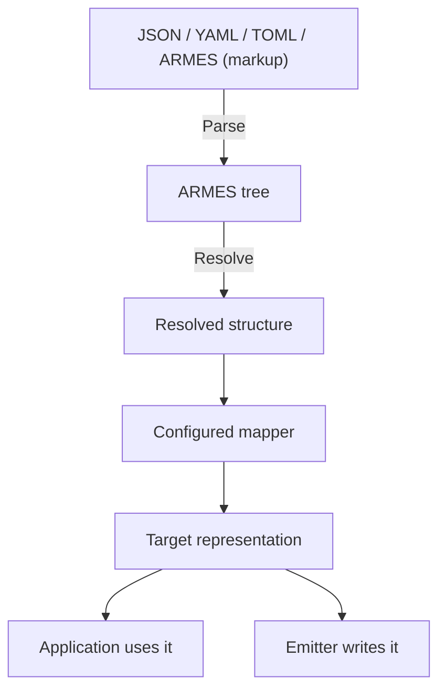

# ARMES

**ARMES — Abstract Representation, Mapping & Expression Syntax —** is a language for describing structures independently of a particular framework or platform. A mapper interprets those structures for the environment where they will be used.

For example, one UI structure can become HTML, React components, or native application controls through the appropriate mappings. You maintain the shared structure while each environment provides its own representation.

JSON, YAML, and TOML are ways to write ARMES documents. ARMES’s foundation is the structure they describe. UI is one application; ARMES can also describe content, configuration, and other structured models.

Use ARMES to:

- **Share structure** across applications and platforms.
- **Configure content and behavior** using capabilities your application provides.
- **Update centrally stored structures** that compatible applications can load.

An application can load its ARMES structure from a server. Updating that structure can change what the application presents or how it behaves without rebuilding it, provided its installed runtime, mappings, and components already support the change.

## Contents

- [Architecture](#architecture)
- [Language](#language)
- [Installation](#installation)
- [Extend ARMES](docs/extending.md)

## Architecture

- **Core:** connects the parts and provides the library API.
- **Parser:** reads a document and builds its tree.
- **Tree:** stores nodes, properties, and children.
- **Runtime:** evaluates conditions, calculations, imports, and enabled references.
- **Mapper:** interprets the structure for a destination.
- **Emitter:** writes a representation as output when needed.



An HTML mapping can lead to HTML text; a React or NativeScript integration can produce components or native views. Those integrations supply their own mappings. The default core does not install platform components.

This is ARMES’s **isomorphic** approach: one authored structure interpreted for multiple environments. Each environment can present it differently.

[Architecture details →](docs/architecture.md)

## Language

This complete document describes a Save button. JSON is used here to make its keys visible:

```json
{
  "button": {
    "@": { "class": "primary" },
    "#": ["Save"]
  }
}
```

- **`button`** names the node. Its representation depends on the mapper.
- **`@`** defines its properties: `class` has the value `primary`.
- **`#`** defines its children, in order.
- **`"Save"`** is a text child.

With the default HTML target:

```html
<button class="primary">Save</button>
```

In node positions, normal keys name nodes; colon-prefixed keys such as `:if` are ARMES commands. Inside `@`, keys name properties.

- **`@`** defines this node’s properties. Start here.
- **`:props`** patches its direct parent’s properties.
- **`:attributes`** performs the same patch as `:props`.

Dynamic expressions can go directly in `@`; they do not require a patch command.

### [Language reference →](docs/README.md)

**Every supported key, with examples and rules.** Browse Keys, Properties, Logic, Types, Imports, References, and Formats.

[Formats](docs/formats.md) shows this same button in YAML, TOML, and ARMES (markup).

## Installation

Requirements: PHP 8.2 or later, Composer, and DOM/libxml for markup parsing.

From this package checkout:

```bash
composer install
```

The package is `armes-lang/core`. For another project, configure its Composer repository before requiring it.

Save as `example.php` beside `vendor/` and run `php example.php`:

```php
<?php
require __DIR__ . '/vendor/autoload.php';

use Armes\Armes;

$core = Armes::default();
$tree = $core->parseJson(<<<'JSON'
{"button":{"@":{"class":"primary"},"#":["Save"]}}
JSON);
echo $core->renderHtml($tree);
// <button class="primary">Save</button>
```

- **Save source:** `$core->sourceJson($tree)` preserves editable structure and commands.
- **Render output:** `$core->renderHtml($tree)` evaluates commands, maps the result, and writes HTML.

Continue to the **[API guide](docs/integration.md)** for application data, loading documents, mapping, and references.
