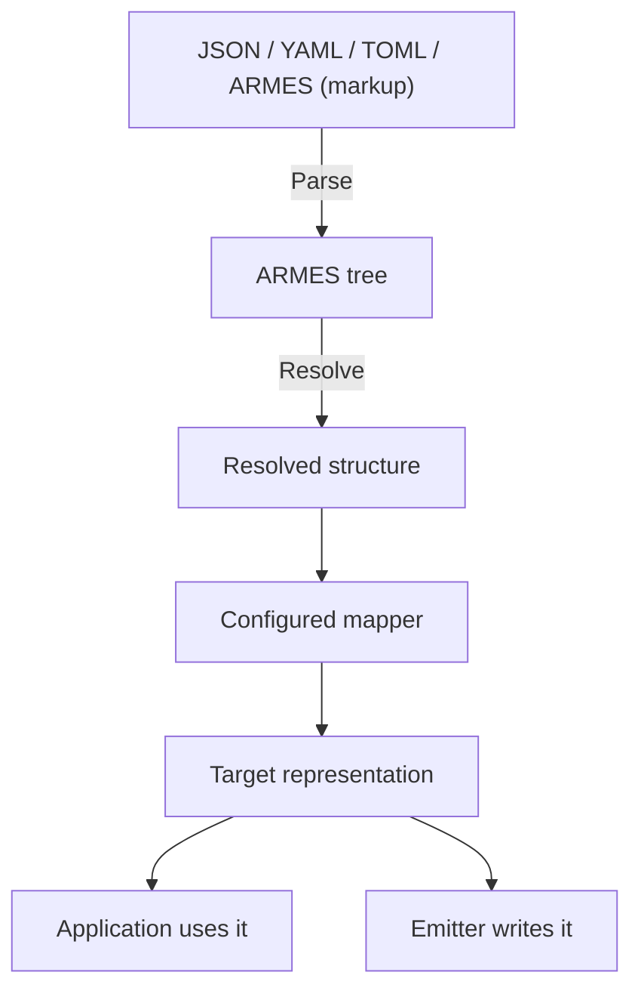
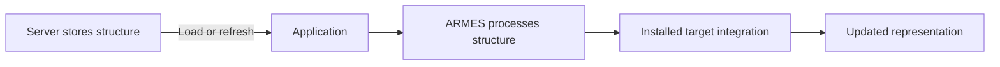
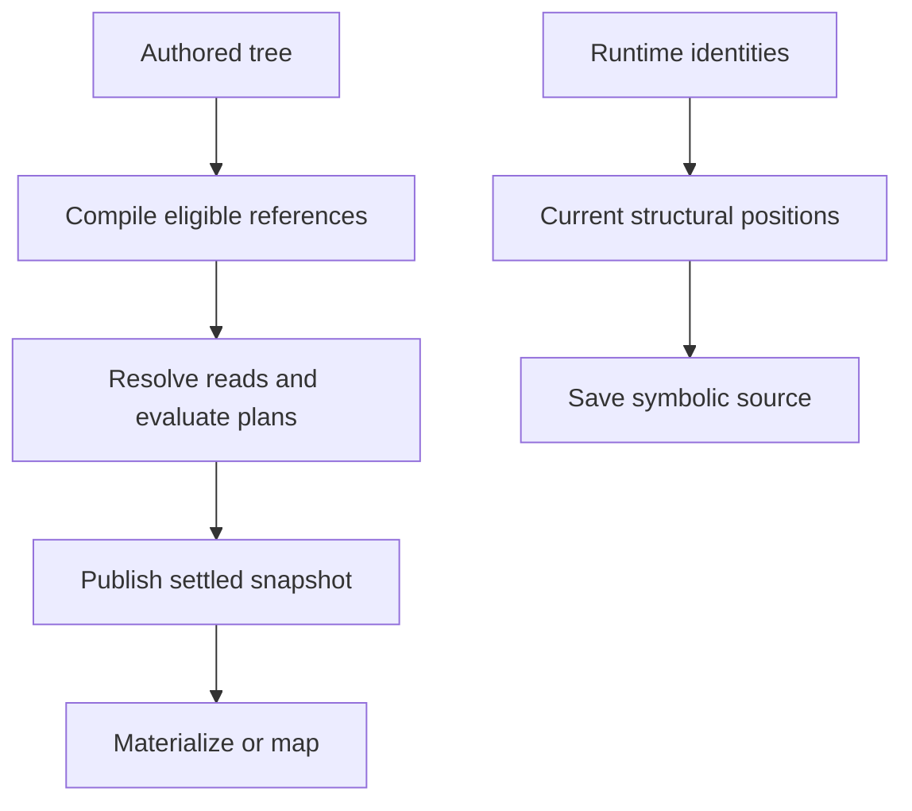

# Architecture

[Language](README.md) · [Next: API](integration.md)

ARMES separates the structure you describe from its representation in a particular environment. This page connects that idea to the library’s parts, then explains the developer details.

## Index

- **Concepts**

  - [Structure](#structure)
  - [Parts](#parts)
  - [Mapping](#mapping)
  - [Server updates](#server-updates)
- **Developers**

  - [Tree](#tree)
  - [Processing](#processing)
  - [Sessions](#sessions)
  - [Scopes](#scopes)
- **Reference**

  - [Terms](#terms)
  - [Implementation](#implementation)

## Structure

ARMES means **Abstract Representation, Mapping & Expression Syntax**. Its documents describe named nodes, properties, children, and expressions. A document can exist in storage or in memory before any application presents it.

Three choices stay separate:

| Choice | Question | Example |
| --- | --- | --- |
| Structure | What are we describing? | A button with a label and properties |
| Source format | How do we write it? | JSON, YAML, TOML, or ARMES (markup) |
| Mapping | How does a destination interpret it? | An HTML element, React component, or native control |

The [Save button](../README.md#language) has the same structure in each of the [format examples](formats.md). Reading a different format does not select a different mapper.

**Isomorphic** describes sharing one authored structure across environments through their mappings. The resulting controls can have different appearances and platform behavior. The destinations must support the names and properties used by the shared document.

Structure is useful beyond UI. For example:

```json
{ "Service": { "@": { "name": "catalog", "region": "eu", "retries": 3 } } }
```

This creates a node named `Service` with three properties. An application could map it to its own configuration model. ARMES does not assign built-in deployment behavior to that name; the application defines what it means in its domain.

## Parts

- **Core:** the application’s entry point for parsing, resolving, rendering, and saving.
- **Parser:** turns source into a common tree. JSON, YAML, and TOML share native-data rules; markup has its own parser.
- **Tree:** stores the document as nodes, properties, and ordered children.
- **Runtime:** evaluates commands and expressions against application data.
- **Mapper:** interprets the resolved structure for a destination.
- **Emitter:** writes a representation as output when needed.



Source saving follows a different path: it writes editable structure and commands from the authored tree. It does not need to evaluate them or map them to a destination.

## Mapping

A mapper is the boundary between shared ARMES structure and a destination’s representation. It decides how node names, properties, children, and values translate for that destination.

For the same authored `button`:

| Configured destination | Possible representation |
| --- | --- |
| HTML | A `button` element with `class="primary"` and text `Save` |
| React | A registered button component with appropriate props and children |
| NativeScript | A native button control with the label and supported styling |

The HTML example works with the default core target. The other rows illustrate mappings supplied by platform integrations; they are not built-in core components. Those integrations can translate properties such as `class` and adapt child text to the platform’s label model.

A mapped representation can be used by an application or passed to an emitter. Platform integrations may have a renderer that creates or updates actual components/views from that representation. An emitter is needed when writing output such as HTML text; it is not a requirement for every use of a mapper.

A **render target**, in the core API, pairs a mapper with an emitter. The core’s `render*()` helpers resolve, map, and emit. Use the mapping API when the application needs the mapped representation itself.

- The mapper owns target-specific names, props, and supported value kinds.
- A prop called `onClick` does not create a core event system. Applications provide supported behavior.
- Mapping and target configuration return new configured instances. Keep the returned value.
- Raw-tree mapping is an explicit tool/editor operation. Normal application presentation should use resolved structure.
- Result adapters provide computations in a reference session; they are separate from mappers.

[Mapping APIs and package differences →](integration.md#custom-mapping)

## Server updates

An application can store its shared ARMES documents on a server and load them when needed:



Changing a supported label, property, arrangement, or condition can update that representation without rebuilding the application. The application must fetch the changed source and apply the new result.

Compatibility means the installed runtime understands the commands and the target integration supports the required names, properties, and behavior. A new native feature or an uninstalled component can still require an application update.

The host application owns document delivery, caching, refresh timing, and applying updates to its UI. ARMES processes the structure supplied to it; it does not provide a deployment or live-synchronization service.

The [API guide](integration.md#application-data) shows how structure and application data enter the core.

## Tree

**Developer detail.** The canonical tree, also called the AST, is the common internal model used after parsing. It has five node kinds:

| Kind | Contains |
| --- | --- |
| Element | Name, props, children |
| Value | Type and value |
| Fragment | Children without a wrapper element |
| Runtime | Command name, props, children, and optional payload |
| Logic | Operation and ordered arguments |

- `:type:int` becomes a Value during parsing.
- `:logic:eq` becomes a Logic node.
- `:if` becomes a Runtime node.
- A Fragment does not add a rendered `div`.
- Source metadata records where a node came from. It is not runtime identity.

`treeJson()` inspects this internal tree. Feeding its `{kind, name, ...}` shape back to the ordinary tag-key `parseJson()` does not reconstruct it as an AST. Use node constructors when building a canonical tree in code.

## Processing

- **Parse:** read syntax and preserve source meaning.
- **Resolve:** evaluate commands with the current context. Only active conditional branches produce content.
- **Map:** interpret names and values as the target’s representation.
- **Emit:** escape and serialize that representation.
- **Save source:** preserve commands for another edit or evaluation, instead of saving only the resolved result.

A mapper does not register parser commands or manage reference dependencies. An emitter does not interpret raw ARMES syntax. A TypeScript loader controls source access; PHP’s existing importer uses filesystem paths.

## Sessions

A reference session adds stable in-memory identity and dependency tracking around the existing tree.



### Reads

- Direct Runtime references and permitted nested envelopes compile into one `CompiledReference` representation.
- `CompiledReference.target` is the consuming expression/value-plan owner.
- For `add(ref(A), ref(B))`, two read dependencies feed one calculation. The operands do not independently write the destination.
- Paths are parsed into typed segments and resolved to handles; execution does not repeatedly search the whole tree for every read.
- A whole-node selection gives an immutable revision-bound `StructuralView`. Materialization creates concrete structure only when required.

### Edits

- Runtime IDs are ephemeral. A structural address describes a position in a saved snapshot, not persistent identity.
- Retained node objects keep identity. Immutable replacements need explicit old-to-new correspondence.
- Copies receive new IDs; session duplication remaps internal references and retains external sources.
- Unknown text replacements cannot infer identity from similar names or content.
- Source save preserves symbolic expressions and inactive content without running providers.
- Broken pins fail normalized saving. A generated pinned selection may require a settled current revision first.

### Revisions

- A transaction batches edits into one authored revision.
- Tree, edges, results, and diagnostics publish together after evaluation settles.
- Failed evaluation publishes an error snapshot without a partially successful output tree. Strict materialization rejects it.
- Settled revisions reuse snapshots. Source/context/dependency changes invalidate calculations; structural and generated changes may conservatively rebuild indexes/caches.
- TypeScript shares pending work for the same revision. New revisions cancel old work and reject obsolete success or failure results, even when a provider ignores cancellation.
- PHP resolves synchronously and publishes at the end of evaluation.

### Generated content

- Each import occurrence is a separate document instance, even if its parsed source was cached.
- Loops retain the document root and select template references in the current iteration context. From outside a repeated instance, select the producer’s result.
- Object iteration keys and adapter-supplied keys can identify generated groups/entries.
- Unkeyed array selections may become stale when their container changes. A stable outer key does not identify every nested array item.
- Result adapters return material data or structure, optionally with unique producer-local keys. Results do not recursively execute `:ref` text.
- An explicit set of selections is not a live “all children” query. No query-selector language is implemented.

### Errors and access

- Missing/deleted sources, ambiguous names, unavailable selections, and active value cycles produce diagnostics.
- Inactive branches are not evaluated or imported just to satisfy a reference.
- Recursive structural views fail if materialization would require an infinite tree.
- Addressable means locatable; selectable means readable; bindable means able to accept an expression. These capabilities are distinct.
- Node names, kinds, metadata, IDs, and mapper registrations are not bindable locations.
- `canSelect` restricts supported reads; it is not a complete ACL system. Visibility is not privacy.
- Permission to use a value does not imply permission to export it. Symbolic source saving does not materialize secrets; hosts own access and export policy.

[Session and result-adapter APIs →](integration.md#reference-sessions)

## Scopes

**TypeScript only, opt-in.** A destination profile chooses active namespaces. This is advanced resolver configuration, not inferred from a mapper name.

The examples below use a `print` namespace registered by the host:

```ts
import { Armes, createTargetScopes } from '@armes-lang/core';

const core = Armes.default();
const scopes = createTargetScopes({
  namespaces: [{ name: 'print' }],
  profiles: { paper: ['print'], screen: [] },
});
const tree = core.parseJson({ p: { ':print:props': { class: 'printed' }, '#': ['Hello'] } });
const result = core.resolveSync(tree, {}, true, { scopes, destination: 'paper' });
// result is p with class="printed".
```

### `:<namespace>:props`

Patch properties for an active namespace.

- **Syntax:** `:<registered namespace>:props` with the body shown below.

```json
{
  "p": {
    "@": {
      "class": "shared"
    },
    ":print:props": {
      "class": "printed"
    },
    "#": [
      "Hello"
    ]
  }
}
```

- **Result:** with `paper`, `p.class` is `printed`.
- **Rules:** A direct property map. The command must be a direct child of an Element.
- **Aliases:** `:<namespace>:attributes` has the same patch behavior.

### `:<namespace>:attributes`

Apply the equivalent scoped property patch.

- **Syntax:** `:<registered namespace>:attributes` with the body shown below.

```json
{
  "p": {
    ":print:attributes": {
      "class": "printed"
    },
    "#": [
      "Hello"
    ]
  }
}
```

- **Result:** with `paper`, `p.class` is `printed`.
- **Rules:** A direct property map, with the same parent and precedence rules as scoped `props`.
- **Aliases:** `:<namespace>:props`.

### `:<namespace>:unset`

Remove named top-level properties for an active namespace.

- **Syntax:** `:<registered namespace>:unset` with the body shown below.

```json
{
  "p": {
    "@": {
      "title": "Hint"
    },
    ":print:unset": {
      "@": {
        "names": [
          "title"
        ]
      }
    },
    "#": [
      "Hello"
    ]
  }
}
```

- **Result:** with `paper`, `p` has no `title` property.
- **Rules:** Use exactly `@.names` with an array of unique, nonempty safe strings. This is deletion; setting null is not deletion.
- **Aliases:** None.

### `:<namespace>:scope`

Include children only for an active namespace.

- **Syntax:** `:<registered namespace>:scope` with the body shown below.

```json
{
  "section": {
    "#": [
      {
        ":print:scope": {
          "#": [
            {
              "p": "Print only"
            }
          ]
        }
      }
    ]
  }
}
```

- **Result:** with `paper`, the section contains the paragraph; with `screen`, it does not.
- **Rules:** Accepts children only, without props or scalar payload. Inactive children are not evaluated or imported.
- **Aliases:** None.

### Scope rules

- Namespace names/aliases start with a lowercase letter, then use lowercase letters, digits, or hyphens. Reserved names and duplicate aliases are rejected.
- Profiles list registered layers once, in increasing precedence.
- Shared `@` and unqualified patches apply first. Active scoped layers follow in profile order, independent of authored position.
- Merge is shallow. Duplicate operations and conflicting set/unset names in one layer are errors. Inactive payload structure is still validated; inactive expressions are not evaluated.
- For scoped ARMES (markup), pass `runtimeNames: scopes.runtimeNames()` to `parseArmes()`.
- There is no unqualified `:unset` or `:scope`, and no scoped `:print:if` or `:print:each`. Put ordinary commands inside a scope.
- Scope is structural inclusion, not access control. Source still retains excluded content.

## Terms

| Term | Meaning |
| --- | --- |
| ARMES | Abstract Representation, Mapping & Expression Syntax; a language for describing structure independently of its destination |
| Addressable | Can be located and diagnosed; does not imply readable or bindable |
| Argument | An input to an operation, such as a Logic operand or import parameter |
| AST / canonical tree | ARMES's common internal structure after parsing |
| Bindable | May accept an expression/reference at that value location |
| Binding | A destination value plan that obtains a value, possibly through references |
| Child | A node structurally contained by another node |
| Command / directive | Colon-prefixed source instruction; may parse into Value, Logic, or Runtime |
| Compiled reference | The common descriptor for a permitted source reference after compilation |
| Context | Data supplied by the application or an enclosing runtime operation |
| Configurable | Supported structure and behavior can be chosen through document data and application configuration |
| Dependency / edge | A tracked read that informs evaluation and invalidation |
| Destination | A target environment or selected profile; not necessarily a single UI framework |
| Document instance | One loaded occurrence of a document, including each import occurrence |
| Domain | A built-in command group, such as `type` or `logic` |
| Element | A named node with props and children |
| Emitter | Produces an output format from a mapped representation or supported tree data |
| Expression | Data describing a computation or lookup |
| Fragment | Ordered children without an added element wrapper |
| Isomorphic | One authored structure interpreted for multiple environments through their mappings |
| Literal | A concrete value already present in source |
| Loader | TypeScript host interface for resolving and reading imported sources |
| Logic node | Canonical operation with an `op` and ordered `args` |
| Mapper | Translates ARMES meaning into a target representation |
| Material value | Concrete scalar/container data rather than a structural handle |
| Materialize | Obtain a concrete tree/value when a consumer needs it |
| Metadata / provenance | Information about where source came from; not node identity |
| Namespace | A qualified name domain; destination namespaces require explicit configuration |
| Operand | One input to a Logic expression |
| Opaque | Contents remain literal data and are not interpreted as ARMES expressions |
| Profile | Ordered active namespaces for TypeScript destination resolution |
| Projection | The supported/allowed view presented to a consumer or target |
| Prop / property | A named value attached to a node |
| Reference | A symbolic selection of another supported structural/value location |
| Render | Resolve, map for the destination, and emit output |
| Resolve | Evaluate commands and expressions against the supplied context |
| Result adapter | Host-owned computation exposing a value or structure in a session |
| Revision | A coherent batch of edits and its settled evaluation |
| Runtime node | One of the five AST kinds, representing contextual processing |
| Runtime node ID | Ephemeral session identity, never a generated ID required in source |
| Scope | Evaluation/instance boundary; also a configured TypeScript inclusion operation |
| Selectable / readable | May supply a value under the supported projection/access contract |
| Serializer | Converts source/tree meaning into a saved representation |
| Source | Authored commands and structure before evaluation |
| Source format | A way to write the structure, such as JSON, YAML, TOML, or ARMES (markup) |
| Structure | The nodes, properties, child relationships, and expressions a document describes |
| Structural address | Snapshot location expressed with typed segments; not persistent identity |
| Structural view | Immutable revision-bound handle to structure, materialized only as needed |
| Target | A host-configured representation or mapper/emitter pair |
| Target representation | The destination-specific model produced by a mapper; it can be used directly or emitted |
| Transaction | A batch of edits submitted as one authored revision |
| Value node | Typed data held as one node |
| Value plan | The expression owned by a destination that computes its final value |

## Implementation

- **TypeScript:** `src/core/Armes.ts`, `src/tree/ArmesNode.ts`, `src/parser/`, `src/runtime/`, `src/mapper/`, and `src/emitter/`.
- **PHP:** `src/Armes.php`, `src/Tree/Node.php`, `src/Parser/`, `src/Runtime/`, `src/Mapper/`, and `src/Emitter/`.
- Both implementations keep five canonical node kinds. Public registration of new node kinds or Logic operators is not supported.
- Keep library behavior, documentation examples, and both copies of shared language pages aligned when changing the language.
