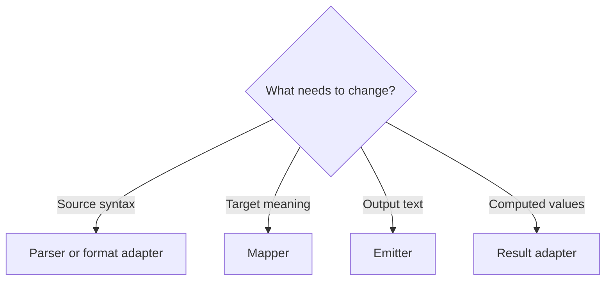
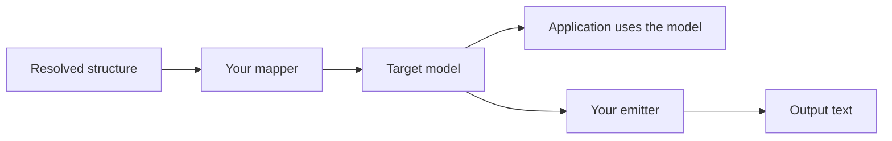
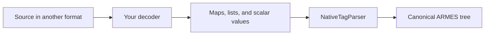

# Extend ARMES

[Language](README.md) · [Next: API](integration.md)

Connect ARMES to your application by choosing the boundary you need to extend. A mapper changes how a destination interprets structure; a parser changes how source becomes that structure.

## Index

- [Choose an extension](#choose-an-extension) — find the right boundary.
- [Custom mapper](#custom-mapper) — produce your own target model.
- [Custom emitter](#custom-emitter) — write the mapped model as text.
- [Source formats and parsers](#source-formats-and-parsers) — read another syntax.
- [Other integrations](#other-integrations) — load sources or provide computations.
- [Limits](#limits) — keep language semantics intact.

## Choose an extension



| Your goal | Use |
| --- | --- |
| Rename one element for an HTML target | [Element mapping](integration.md#custom-mapping) |
| Interpret structure as an application model | [Custom mapper](#custom-mapper) |
| Write a mapped model as text | [Custom emitter](#custom-emitter) |
| Read another source syntax | [Parser or format adapter](#source-formats-and-parsers) |
| Supply computed values or generated structure | [Result adapter](integration.md#result-adapters) |

## Custom mapper

This example maps a `Service` node into a small configuration object. It returns data directly, without an emitter.

```php
<?php
require __DIR__ . '/vendor/autoload.php';

use Armes\Armes;
use Armes\Mapper\MapperInterface;
use Armes\Mapper\MappingContext;
use Armes\Tree\Node;

final class ServiceMapper implements MapperInterface
{
    public function map(Node $node, ?MappingContext $context = null): mixed
    {
        if ($node->kind !== 'element' || $node->name !== 'Service') {
            throw new RuntimeException('Expected one Service node');
        }
        return ['name' => (string) $node->props['name'], 'region' => (string) $node->props['region']];
    }
}

$core = Armes::default();
$tree = $core->parseJson('{"Service":{"@":{"name":"catalog","region":"eu"}}}');
$result = (new ServiceMapper())->map($core->resolve($tree));
echo json_encode($result, JSON_THROW_ON_ERROR);
// {"name":"catalog","region":"eu"}
```

`MapperInterface` implements `map(Node $node, ?MappingContext $context = null): mixed`. Resolve commands before calling a mapper directly. PHP has no ordinary `core.map()` facade; reference sessions also provide a mapping method. The example accepts one root node; a mapper for nested structures must decide how to process children and other supported node kinds.

## Custom emitter



Implement `EmitterInterface` when you need to write the target model as text. Its `emit` method receives mapped data and returns a string. Keep parsing and runtime evaluation outside that method; apply escaping appropriate to the output format.

Pair a mapper and emitter with `RenderTarget` and register it through `withRenderTarget()`. The [custom mapping example](integration.md#custom-mapping) shows how to connect a target to the core’s render helpers.

## Source formats and parsers



If your format decodes into ordinary maps, lists, and scalar values using ARMES’s node-key conventions, pass that data to `NativeTagParser`. This keeps the existing rules for node names, `@`, `#`, and commands.

The example starts with data a decoder could return:

```php
<?php
require __DIR__ . '/vendor/autoload.php';

use Armes\Armes;
use Armes\Parser\Native\NativeTagParser;

$decoded = ['button' => ['@' => ['class' => 'primary'], '#' => ['Save']]];
$tree = (new NativeTagParser())->parse($decoded);
echo Armes::default()->renderHtml($tree);
// <button class="primary">Save</button>
```

For a syntax that does not fit node-key data, write a parser that constructs nodes with the `Armes\Tree\Node` factories. Return a `Node`; do not add a new AST kind. Call this adapter from your application, then pass its tree to the core. There is no public registry for adding a new `parseMyFormat()` facade method.

## Other integrations

- [Imports](integration.md#imports) — load another document using the package’s supported source-loading behavior.
- [Result adapters](integration.md#result-adapters) — expose host computations or generated structures through a reference session.
- [Architecture](architecture.md) — understand resolution, mapping, sessions, and target boundaries.

## Limits

- A custom mapper defines target meaning; it does not register new language commands.
- A format adapter must preserve ARMES semantics and literal boundaries. A plain name such as `eq` remains a node name.
- Core does not expose a public registry for adding AST kinds, Logic operators, or ordinary resolver commands.
- Result-adapter registration is a separate, explicit session extension. It does not make arbitrary code in source executable.
- Mappers do not own reference identity, dependency scheduling, or source serialization.

For API configuration and error handling, continue to the [API guide](integration.md).
