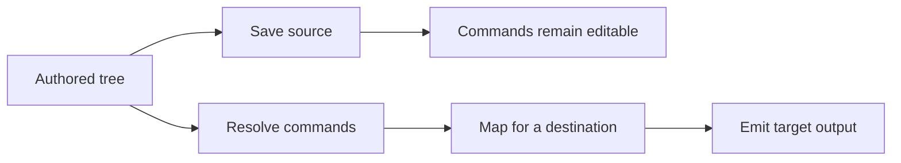

# Formats

[Language](README.md) · [Next: Architecture](architecture.md)

A format determines how you write the structure. A mapper determines how a destination represents it. Choosing YAML instead of JSON does not choose a different UI framework or mapper.

The examples below describe the same Save button from the [introduction](../README.md#language). JSON, YAML, and TOML use the same node-key rules; ARMES (markup) writes nodes as tags. Format limits matter for more complex values, as noted below.

## Index

- [JSON](#json)
- [ARMES (markup)](#markup)
- [YAML](#yaml)
- [TOML](#toml)
- [Pkl](#pkl)
- [Saving](#saving)

## JSON

```json
{ "button": { "@": { "class": "primary" }, "#": ["Save"] } }
```

- Read with `parseJson()`.
- JSON has no comments or trailing commas.
- Use arrays for repeated children; do not repeat object keys.
- Save editable JSON with `sourceJson()`, or `session.source('json')` after reference-aware edits.

<a id="markup"></a>

## ARMES (markup)

```armes
<button class="primary">Save</button>
```

- Read ARMES (markup) with `parseArmes()`.
- Attributes become props; nested tags and text become children.
- Use `parseHtml()` for ordinary HTML and `parseXml()` for XML.
- ARMES command tags are supported in its dedicated parser mode:

```armes
<:logic:add><:type:int>2</:type:int><:type:int>3</:type:int></:logic:add>
```

- **Result:** the number `5`.
- Explicit types keep numbers from being treated as ordinary text.
- Prefer readable command names to symbol aliases in hand-written markup.
- Markup does not preserve every expression/property shape equally across PHP and TypeScript. See [markup limits](troubleshooting.md#markup) before converting a complex document.

## YAML

```yaml
button:
  "@":
    class: primary
  "#":
    - Save
```

- Read with `parseYaml()`.
- Quote `@`, `#`, and colon-prefixed command keys to avoid punctuation ambiguity.
- Quote text such as `"false"` when it must stay a string.
- YAML supports scalar, list, and map roots.

## TOML

```toml
[button]
"@" = { class = "primary" }
"#" = ["Save"]
```

- Read with `parseToml()`.
- Quote reserved/command keys. Inline tables can hold expressions.
- Document roots must be map/object-shaped. TOML cannot represent null.
- Do not silently convert unsupported values to strings to force a save.

The button examples above all produce `<button class="primary">Save</button>` through the default HTML target.

## Pkl

**PHP only; requires the `pkl` CLI.**

- `parsePkl()` and `parsePklFile()` evaluate trusted local modules into native data before parsing.
- `renderPkl()` writes resolved tree data with a map/object root.
- Pkl evaluation is an explicit host operation with process limits and a restricted root. It is not a `:pkl` runtime command.

## Saving



Choose the operation by what you want to keep:

| Operation | Meaning |
| --- | --- |
| `sourceJson()` / `sourceArmes()` | Save editable source with commands |
| `session.source('json' / 'yaml' / 'toml')` | Save symbolic source with updated reference addresses |
| `treeJson()` | Inspect the internal tree without resolving it |
| `resolve()` | Evaluate commands into a tree |
| `renderHtml()` / `renderXml()` | Resolve, map, and write output |
| `renderYaml()` / `renderToml()` | Serialize evaluated tree data |

- There is no ordinary `sourceYaml()` or `sourceToml()` facade. Outside a session, use the format library to serialize tag-key source data obtained from the source serializer.
- Do not use evaluated render output as a substitute for editable source: inactive branches, imports, and loops have already been consumed.
- Saving may normalize aliases, child shorthand, whitespace, and quoting.
- Object/array type wrappers remain when needed to keep data literal.
- Source-format comments and original formatting are not preserved byte for byte.
- Runtime IDs, dependency edges, and generated results are not written into symbolic session source.

[API examples →](integration.md)
