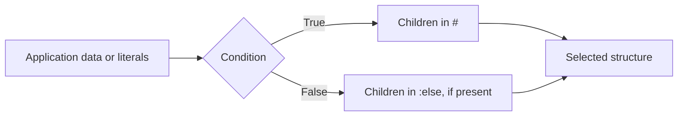

# Logic

[Language](README.md) · [Next: Types](values.md)

Use logic to choose parts of a structure, repeat them, read application data, or calculate a value. These operations run before mapping, so their results can serve different destinations. Start with the operation you need. HTML examples below show one representation of the resulting structure.

## Index

- **Conditions**

  - [`:if`](#if) — choose the branch for a true condition.
  - [`:else`](#else) — provide the branch for a false condition.

- **Repeat**

  - [`:each`](#each) — repeat a template for each item.

- **Read data**

  - [`:logic:var`](#logicvar) — read application data, with an optional fallback.

- **Compare**

  - [`:logic:eq`](#logiceq) — test whether two values are equal.
  - [`:logic:ne`](#logicne) — test whether two values differ.
  - [`:logic:gt`](#logicgt) — test whether the first value is greater.
  - [`:logic:gte`](#logicgte) — test whether it is greater or equal.
  - [`:logic:lt`](#logiclt) — test whether the first value is less.
  - [`:logic:lte`](#logiclte) — test whether it is less or equal.

- **Combine**

  - [`:logic:and`](#logicand) — test whether every condition is true.
  - [`:logic:or`](#logicor) — test whether any condition is true.
  - [`:logic:not`](#logicnot) — reverse a condition’s truth value.

- **Calculate**

  - [`:logic:add`](#logicadd) — add numbers.
  - [`:logic:sub`](#logicsub) — subtract numbers.
  - [`:logic:mul`](#logicmul) — multiply numbers.
  - [`:logic:div`](#logicdiv) — divide numbers.
  - [`:logic:mod`](#logicmod) — find the remainder after division.

- **Older forms**

  - [`:logic`](#logic) — write an operation in the legacy wrapper form.
  - [`:expr`](#expr) — write a legacy data expression.



Internally, `:if`, `:else`, and `:each` are Runtime commands; `:logic:eq` and the other operations create Logic nodes. They are grouped here because they are useful together, not because they have the same internal node kind.

## `:if`

Choose content when a condition is true.

- **Syntax:** `@.test` is the condition; `#` is the true branch; body-level `:else` is optional.

```json
{
  ":if": {
    "@": {
      "test": true
    },
    "#": [
      {
        "p": "Ready"
      }
    ],
    ":else": [
      {
        "p": "Waiting"
      }
    ]
  }
}
```

- **Result:** `<p>Ready</p>`.
- **Rules:** Only the chosen branch is evaluated. Prefer boolean tests or explicit comparisons. A false test with no `:else` produces no children.
- **Aliases:** None.

## `:else`

Provide the content for a false condition.

- **Syntax:** a child list under `:else` in the enclosing `:if` body.

```json
{
  ":if": {
    "@": {
      "test": false
    },
    "#": [
      {
        "p": "Ready"
      }
    ],
    ":else": [
      {
        "p": "Waiting"
      }
    ]
  }
}
```

- **Result:** `<p>Waiting</p>`.
- **Rules:** Use it only as part of `:if`. Put another `:if` in this list for an additional condition; there is no portable `:elseif`. The body-level form shown here is the portable JSON form.
- **Aliases:** None.

## `:each`

Repeat a child template for each item in a list or object.

- **Syntax:** `@.items` supplies data; optional `@.as` and `@.index` name the item and position; `#` is the template.

```json
{
  "ul": {
    "#": [
      {
        ":each": {
          "@": {
            "items": {
              ":type:array": [
                "Ada",
                "Grace"
              ]
            },
            "as": "name"
          },
          "#": [
            {
              "li": {
                ":logic:var": "name"
              }
            }
          ]
        }
      }
    ]
  }
}
```

- **Result:** `<ul><li>Ada</li><li>Grace</li></ul>`.
- **Rules:** `as` defaults to `item`; `index` defaults to `index`. The loop context also contains `key`. Empty data produces no children. For object iteration, use `key`: PHP’s `index` is a numeric position, while TypeScript’s is the entry key.
- **Aliases:** None.

## `:logic:var`

Read a value supplied by the application or an enclosing loop/import.

- **Syntax:** a dotted path string, or `[path, fallback]`.

```json
{
  ":logic:var": [
    "user.name",
    "Guest"
  ]
}
```

- **Result:** `"Guest"` with no supplied user; `"Ada"` if context contains `user.name = "Ada"`.
- **Rules:** An empty path reads the whole context. Dots separate members; there is no escape for a literal dot in a context key. Supply a fallback when a missing value needs a predictable type. This reads application context, not a structural document address.
- **Aliases:** `:var`.

## `:logic:eq`

Compare two values for equality.

- **Syntax:** an ordered array of arguments.

```json
{
  ":logic:eq": [
    3,
    3
  ]
}
```

- **Result:** `true`.
- **Rules:** Provide two values of the same intended type for portable comparisons. Equality is coercive; it is not strict type-and-value equality.
- **Aliases:** `:eq`, `:==`, `:logic:==`.

## `:logic:ne`

Check whether two values differ.

- **Syntax:** an ordered array of arguments.

```json
{
  ":logic:ne": [
    3,
    4
  ]
}
```

- **Result:** `true`.
- **Rules:** Provide two comparable values. This is the inverse of `eq`, with the same coercion rules.
- **Aliases:** `:ne`, `:!=`, `:logic:!=`.

## `:logic:gt`

Check whether the first number is greater than the second.

- **Syntax:** an ordered array of arguments.

```json
{
  ":logic:gt": [
    5,
    3
  ]
}
```

- **Result:** `true`.
- **Rules:** Provide two numbers.
- **Aliases:** `:gt`, `:>`, `:logic:>`.

## `:logic:gte`

Check whether the first number is greater than or equal to the second.

- **Syntax:** an ordered array of arguments.

```json
{
  ":logic:gte": [
    3,
    3
  ]
}
```

- **Result:** `true`.
- **Rules:** Provide two numbers.
- **Aliases:** `:gte`, `:>=`, `:logic:>=`.

## `:logic:lt`

Check whether the first number is smaller than the second.

- **Syntax:** an ordered array of arguments.

```json
{
  ":logic:lt": [
    2,
    3
  ]
}
```

- **Result:** `true`.
- **Rules:** Provide two numbers.
- **Aliases:** `:lt`, `:<`, `:logic:<`.

## `:logic:lte`

Check whether the first number is smaller than or equal to the second.

- **Syntax:** an ordered array of arguments.

```json
{
  ":logic:lte": [
    3,
    3
  ]
}
```

- **Result:** `true`.
- **Rules:** Provide two numbers.
- **Aliases:** `:lte`, `:<=`, `:logic:<=`.

## `:logic:and`

Check that all conditions are true.

- **Syntax:** an ordered array of arguments.

```json
{
  ":logic:and": [
    true,
    false
  ]
}
```

- **Result:** `false`.
- **Rules:** Use boolean conditions for portable behavior. Any number is accepted; an empty list returns true.
- **Aliases:** `:and`. No symbol alias.

## `:logic:or`

Check that at least one condition is true.

- **Syntax:** an ordered array of arguments.

```json
{
  ":logic:or": [
    false,
    true
  ]
}
```

- **Result:** `true`.
- **Rules:** Use boolean conditions for portable behavior. Any number is accepted; an empty list returns false.
- **Aliases:** `:or`. No symbol alias.

## `:logic:not`

Reverse a condition.

- **Syntax:** an ordered array of arguments.

```json
{
  ":logic:not": [
    true
  ]
}
```

- **Result:** `false`.
- **Rules:** Provide one boolean condition.
- **Aliases:** `:not`, `:!`, `:logic:!`.

## `:logic:add`

Add numbers.

- **Syntax:** an ordered array of arguments.

```json
{
  ":logic:add": [
    2,
    3,
    4
  ]
}
```

- **Result:** `9`.
- **Rules:** This is numeric addition, not string concatenation. An empty list returns zero.
- **Aliases:** `:add`, `:+`, `:logic:+`.

## `:logic:sub`

Subtract later numbers from the first.

- **Syntax:** an ordered array of arguments.

```json
{
  ":logic:sub": [
    10,
    3,
    2
  ]
}
```

- **Result:** `5`.
- **Rules:** A single argument negates that number; `[3]` returns `-3`. Use numbers.
- **Aliases:** `:sub`, `:-`, `:logic:-`.

## `:logic:mul`

Multiply numbers.

- **Syntax:** an ordered array of arguments.

```json
{
  ":logic:mul": [
    2,
    3,
    4
  ]
}
```

- **Result:** `24`.
- **Rules:** Use numbers. An empty list returns one.
- **Aliases:** `:mul`, `:*`, `:logic:*`.

## `:logic:div`

Divide the first number by each later number.

- **Syntax:** an ordered array of arguments.

```json
{
  ":logic:div": [
    12,
    3,
    2
  ]
}
```

- **Result:** `2`.
- **Rules:** Provide at least two numbers. Never use a zero divisor.
- **Aliases:** `:div`, `:/`, `:logic:/`.

## `:logic:mod`

Find the remainder after division.

- **Syntax:** an ordered array of arguments.

```json
{
  ":logic:mod": [
    10,
    3
  ]
}
```

- **Result:** `1`.
- **Rules:** Provide two integers for portable behavior. The divisor must be nonzero.
- **Aliases:** `:mod`, `:%`, `:logic:%`.

## `:logic`

Wrap one Logic operation using an older accepted form.

- **Syntax:** an object containing exactly one colon-prefixed operator.

```json
{
  ":logic": {
    ":eq": [
      1,
      1
    ]
  }
}
```

- **Result:** `true`.
- **Rules:** The inner key must begin with `:`. Prefer `:logic:eq` directly in new source. The wrapper adds no operation.
- **Aliases:** The equivalent direct form here is `{":logic:eq":[1,1]}`.

## `:expr`

Evaluate a legacy data expression.

- **Syntax:** an expression payload that may use older bare operator names.

```json
{
  ":expr": {
    "eq": [
      1,
      1
    ]
  }
}
```

- **Result:** `true`.
- **Rules:** This is compatibility syntax, not PHP or JavaScript source. Use the Logic domain for new documents. TypeScript’s legacy bare `in` operation is not portable and is not a supported `:logic:in` command.
- **Aliases:** No exact alias for every legacy payload; migrate supported operations to `:logic:*`.

## Combining

Use one expression as another expression’s argument. Here equality supplies the condition:

```json
{
  ":if": {
    "@": { "test": { ":logic:eq": [2, 2] } },
    "#": [{ "p": "Equal" }],
    ":else": [{ "p": "Different" }]
  }
}
```

- **Result:** `<p>Equal</p>`.
- A child expression produces a value child; a property expression produces that property’s value.
- `"user.name"` alone is text. It becomes a lookup only inside `:logic:var`.
- Core has no `${…}` or `{{…}}` interpolation. Use adjacent text/value children or supply a complete string.
- Use booleans for conditions and numbers for arithmetic. PHP and JavaScript differ in truthiness, missing values, and coercion; see [Compatibility](troubleshooting.md).
- Prefer readable `:logic:*` names. Source saving normally normalizes aliases to that spelling; symbol output is an API option.
