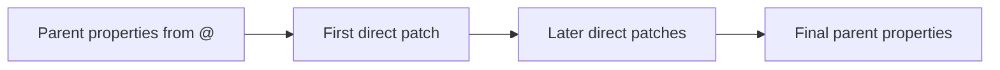

# Properties

[Language](README.md) · [Next: Logic](logic.md)

Properties describe a node. They can become HTML attributes, component options, or other target-specific values through a mapper. Use `@` to define them; use `:props` when you want a separate command to update the direct parent’s properties.

## Index

- [Choice](#choice)
- [`@`](#at)
- [`:props`](#props)
- [`:attributes`](#attributes)
- [Order](#order)
- [Expressions](#expressions)

## Choice

| Key | Meaning | Use |
| --- | --- | --- |
| `@` | Properties attached to this node | Default choice |
| `:props` | Patch the direct parent element | An explicit property override |
| `:attributes` | Same patch operation as `:props` | Alternative accepted name |

`:attributes` does not create a separate HTML-only container. Both patch commands update the same properties; the mapper determines how they appear in output.

<a id="at"></a>

## `@`

Define the enclosing node’s properties.

- **Syntax:** an object of property names and values.

```json
{
  "input": {
    "@": {
      "type": "email",
      "required": true
    }
  }
}
```

- **Result:** the HTML input has `type="email"` and `required`.
- **Rules:** Literal values and direct supported expressions are allowed. `@` does not mean “static only.”
- **Aliases:** None.

## `:props`

Update the direct parent element’s properties.

- **Syntax:** a direct object of properties to set.

```json
{
  "input": {
    "@": {
      "type": "text"
    },
    "#": [
      {
        ":props": {
          "type": "email"
        }
      }
    ]
  }
}
```

- **Result:** the input’s `type` is `email`. The patch command does not render as a tag.
- **Rules:** It must be a direct child of an element. It cannot stand alone or search upward through `:if` for a parent. Use the direct map payload shown here for PHP/TypeScript portability.
- **Aliases:** `:attributes` performs the same operation.

## `:attributes`

Update the direct parent element, using the alternative patch name.

- **Syntax:** the same direct property map accepted by `:props`.

```json
{
  "input": {
    "@": {
      "type": "email"
    },
    ":attributes": {
      "required": true
    }
  }
}
```

- **Result:** the input keeps `type="email"` and gains `required`.
- **Rules:** The placement and merge rules are exactly the same as for `:props`. Prefer one spelling consistently.
- **Aliases:** `:props`.

## Order



1. Start with the parent’s `@` properties.
2. Apply direct `:props` and `:attributes` children in child order.
3. A later value replaces an earlier value with the same name.

- Merging is shallow: a new `style` object replaces the old `style` object; their members are not merged.
- `null` is a value, not a delete command. An output emitter may omit null attributes.
- A patch inside `:if` has `:if` as its parent and cannot patch an element above it.
- Dynamic values can go directly in `@`; they do not require a patch.

## Expressions

```json
{
  "input": {
    "@": {
      "value": { ":logic:var": ["user.email", ""] }
    }
  }
}
```

- With `user.email` in application data, that value becomes the input’s value.
- Without it, the fallback is an empty string.
- Read about [`:logic:var`](logic.md#logicvar) and [`:ref`](references.md#ref) for the two kinds of lookup.
- Plain nested data is not automatically an expression. Use typed literal boundaries when a data object must remain opaque.

TypeScript’s configured destination patches have additional precedence rules. They are documented under [Architecture → Scopes](architecture.md#scopes).
