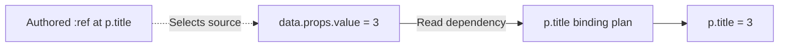

# References

[Language](README.md) · [Next: Formats](formats.md)

Use a reference when one value should come from another location in the document. The application must enable a **reference session**; ordinary rendering does not enable this automatically.

## Index

- [`:ref`](#ref)
- [Addresses](#addresses)
- [Values and nodes](#values-and-nodes)
- [Literal data](#literal-data)
- [Editing](#editing)



The arrow into the plan represents a read. The plan computes the destination value; source references do not independently write it.

## `:ref`

Select another node or value in the current document instance.

- **Syntax:** `{ ":ref": "structural address" }` in a supported expression location.

```json
{
  "section": {
    "#": [
      { "data": { "@": { "value": 3 } } },
      {
        "p": {
          "@": { "title": { ":ref": "$/child/section/child/data/props/value" } },
          "#": ["Count"]
        }
      }
    ]
  }
}
```

- **Result:** the paragraph’s `title` becomes `3`. The saved source keeps the reference.
- **Rules:** the destination declares the dependency. The source does not list consumers. Both the destination and selected source must support the operation.
- **Aliases:** none. `:from`, `:select`, and `:bind` are not source aliases.

[`API → Reference sessions`](integration.md#reference-sessions) shows the code to resolve, render, and save this example.

## Addresses

Read `$/child/section/child/data/props/value` as:

1. **`$`** — start at this document instance.
2. **`child/section`** — find its unique child named `section`.
3. **`child/data`** — find that node’s unique child named `data`.
4. **`props/value`** — select its `value` property.

All supported address segments:

| Segment | Selects |
| --- | --- |
| `child/name` | One uniquely named structural child |
| `children/1` | Structural child at zero-based index 1 |
| `props/name` | A property |
| `value` | A Value node’s data or supported payload |
| `member/name` | A member of ordinary object data |
| `item/2` | An ordinary array’s item at index 2 |
| `args/0` | A Logic operand |
| `branch/then` or `branch/else` | A conditional branch, followed by a child selection |
| `result` | A supported producer’s evaluated result |
| `entry/key` | A keyed entry in a generated result |

- Descend as deeply as needed by adding segments.
- Duplicate child names are ambiguous; use `children/index` instead.
- Escape `~` as `~0` and `/` as `~1` within names. Dots and colons are literal characters.
- Indexes are nonnegative integers without leading zeroes.
- Reserved data/property members `__proto__`, `prototype`, and `constructor` are rejected.
- Each imported occurrence has its own `$`. There are no global or parent-document escape paths.
- There are no wildcard, filter, or query selectors.

## Values and nodes

- `$/child/Car` selects a structural view of a node and its structure.
- `$/child/Car/child/Wheels` selects a descendant’s structure.
- `$/child/Counter/props/value` selects a property’s material value.
- `$/child/User/props/profile/member/name` selects ordinary nested data.

The destination must accept the selected kind. A whole `Image` node does not automatically mean image bytes; a property or result adapter must expose those bytes.

Use `:logic:var` for data supplied by the application. Use `:ref` for a supported location in the document. An address written as an ordinary string remains text.

## Literal data

References are recognized in supported expression locations, such as direct props, modifier values, child expressions, Logic operands, and documented runtime inputs. Arbitrary nested property data does not become executable because it contains `":ref"`.

```json
{
  "Widget": {
    "@": {
      "payload": { "external": { ":ref": "some-data-id" } }
    }
  }
}
```

- In an enabled session, the nested envelope remains literal data—even if its text is a valid ARMES address.
- Hosts can opt particular nested locations into expression handling.
- To keep an exact envelope literal at an expression-capable location, wrap it in `:type:object`:

```json
{ "Widget": { "@": { "payload": { ":type:object": { ":ref": "some-data-id" } } } } }
```

Typed object/array contents are always literal. No callback can enable expressions inside them.

## Editing

- A session gives nodes in-memory identities. These IDs are not saved into source.
- Moving a node keeps its reference attached when the edit preserves identity.
- Saving updates the address to the source’s current position.
- Deleting a source creates a broken reference; it does not retarget the new occupant of that position.
- A fresh text parse has no hidden identity history. Update positional references when manually reordering arrays.
- Save through the session after reference-aware edits. If a pinned source cannot be represented safely, normalized saving fails with a diagnostic.

For expression ownership, immutable edits, generated results, cycles, and async behavior, see [Architecture → Sessions](architecture.md#sessions).
