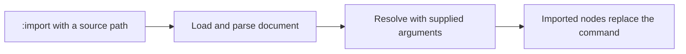

# Imports

[Language](README.md) · [Next: References](references.md)

Include another ARMES document with `:import`. Use `:include` if you prefer its equivalent spelling.

## Index

- [`:import`](#import)
- [`:include`](#include)
- [Arguments and appended children](#arguments)
- [Rules](#rules)



## `:import`

Load and include another JSON ARMES document.

- **Syntax:** a path string, or a body with `@.src`, optional `@.props`, and appended `#` children.

```json
{
  ":import": "./Card.armes.json"
}
```

- **Result:** the imported document’s resolved nodes replace the import command. With the file below, HTML output is `<p>Welcome</p>`.
- **Rules:** PHP loads from the filesystem; TypeScript needs a configured loader. Paths resolve relative to source provenance. Use a literal path for portable imports.
- **Aliases:** `:include`.

For this example, put the following source in `Card.armes.json`:

```json
{ "p": "Welcome" }
```

[`API → Imports`](integration.md#imports) shows how to load an entry file or configure a loader.

## `:include`

Include a document using the alternative import name.

- **Syntax:** the same string or object body as `:import`.

```json
{
  ":include": "./Card.armes.json"
}
```

- **Result:** with the file above, `<p>Welcome</p>`.
- **Rules:** All path, argument, child, and error rules are identical to `:import`. It is source inclusion, not navigation.
- **Aliases:** `:import`.

## Arguments

Pass values through the import’s `props` argument:

```json
{
  ":import": {
    "@": {
      "src": "./Title.armes.json",
      "props": { "title": "Welcome" }
    },
    "#": [{ "p": "Additional content" }]
  }
}
```

`Title.armes.json`:

```json
{ "article": { "#": [{ "h2": { ":logic:var": ["props.title", "Untitled"] } }] } }
```

- **Result:** `<article><h2>Welcome</h2><p>Additional content</p></article>`.
- `src` is the path to load.
- `props` here is an import argument name. It is not another spelling of `@` or `:props`.
- Argument values extend the imported context and are available under `props` too.
- `#` appends children to the imported root Element or Fragment. There is no named-slot language.

## Rules

- Built-in imports read JSON source. They do not infer YAML or markup from file extensions.
- Use file parsing or supply a source path when parsing text so relative imports have a reliable base.
- Missing files and circular imports are errors.
- Imports may cache parsed source. Applications own external changes and refresh policy.
- Keep appended content literal for portability: TypeScript resolves it in imported context; PHP resolves it in parent context.
- TypeScript can resolve a `src` expression; PHP’s ordinary importer expects a string.
- Inside a reference session, every import occurrence has its own document-local `$` root.
