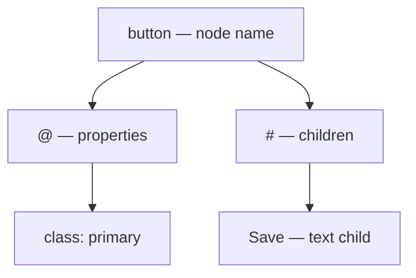

# Keys

[Language](README.md) · [Next: Properties](properties.md)

A key is the name in a name–value entry, as used in JSON, YAML, and TOML. Its position tells ARMES whether it names a node, a property, or a command. The examples here use JSON; [Formats](formats.md) shows other ways to write the same structure.

## Index

- [Names](#names)
- [Properties `@`](#at)
- [Children `#`](#hash)
- [Commands](#commands)
- [Children](#children)
- [Shorthand](#shorthand)
- [Inert keys](#inert-keys)
- [Unsupported keys](#unsupported-keys)



## Names

Create a node with a normal key, such as `button`, `section`, or `Card`. The name describes part of your model; the mapper determines its target meaning.

- **Syntax:** `{ "name": content }`

```json
{ "button": "Save" }
```

- **Result:** an element named `button` containing the text `Save`; default HTML output is `<button>Save</button>`.
- **Rules:** normal keys in a node body describe children. Names inside `@` describe properties instead. A name such as `ui.input` is one name; the dot does not create a nested node.
- **Aliases:** node names are chosen by the author; their output meaning is defined by the mapper.

<a id="at"></a>

## `@`

Give the enclosing node its properties.

- **Syntax:** `{ "name": { "@": { "property": value } } }`

```json
{ "button": { "@": { "class": "primary" }, "#": ["Save"] } }
```

- **Result:** `<button class="primary">Save</button>` with the default HTML target.
- **Rules:** `@` must contain an object. A property is a named value, not a child. Commands can also have their own properties, such as `:if`'s `test`.
- **Aliases:** none; `:props` is a parent-patching command, not an interchangeable container.

[Properties and patching →](properties.md)

<a id="hash"></a>

## `#`

Give the enclosing node its children.

- **Syntax:** `{ "name": { "#": [child, child] } }`

```json
{ "div": { "#": [{ "p": "First" }, { "p": "Second" }] } }
```

- **Result:** `<div><p>First</p><p>Second</p></div>`.
- **Rules:** use an array to preserve order and repeat names. Each child can be a value, a named node, or a supported command. `@` and `#` belong inside a node body, not alone at the document root.
- **Aliases:** the array-body shorthand below can omit `#` when no properties are needed.

## Commands

A leading colon identifies an ARMES command.

```json
{ ":logic:add": [2, 3] }
```

- **Result:** the number `5` after evaluation.
- **Runtime keys**, such as `:if`, choose or produce content during processing.
- **Logic keys**, such as `:logic:add`, calculate or look up values.
- **Type keys**, such as `:type:int`, declare literal value types.
- Some other commands describe text or markup; `:ref` requires a reference session.

These are different kinds of commands. Not every colon-prefixed key becomes an internal Runtime node. The [language index](README.md) lists supported commands by purpose.

Bare `eq`, `logic:eq`, and `type:int` are ordinary names in JSON source. Use the leading colon for commands. Inventing a command name does not install an implementation.

## Children

An array can hold several root nodes without adding a wrapper element:

```json
[{ "h1": "Title" }, { "p": "Body" }]
```

- This group is called a **Fragment**.
- Nested nodes form a tree: a parent contains children, and each child can contain more children.
- Arrays in child positions describe structure. For an array that is only data, use [`:type:array`](values.md#typearray).
- Do not repeat JSON object keys. A decoder can discard earlier entries before ARMES reads them.

## Shorthand

Choose the simplest form that keeps the meaning clear:

| Write | Meaning |
| --- | --- |
| `{"button":"Save"}` | One text child |
| `{"button":["Save"]}` | A one-item child list |
| `{"section":{"button":"Save"}}` | A named child inside `section` |
| `{"button":{"@":{"class":"primary"},"#":["Save"]}}` | Properties and children |
| `{"button":[]}` | An empty element |

Important rules:

- `{"div":{"class":"card"}}` creates a child named `class`. It does not set a property.
- `{"Counter":3}` creates a numeric child. Set a `value` property with `{"Counter":{"@":{"value":3}}}`.
- If you mix `#` and additional child entries in one body, `#` children come first, followed by the other entries in their encountered order.
- For portable, addressable structure, use one `#` array with one named node per entry. Empty objects and some multi-key child-map shapes differ between PHP and TypeScript.

## Inert keys

`:php`, `:js`, `:ts`, and `:code` are recognized payload names, but core does not execute them. Strict processing rejects them; loose processing warns and drops them from output.

## Unsupported keys

There is no portable built-in `:elseif`, `:from`, `:select`, `:bind`, `:inputs`, `:outputs`, `:logic:in`, or `:logic:xor`. Use nested `:if` for another condition. Unknown types and commands are not automatic extensions.

[Compatibility and errors →](troubleshooting.md)
